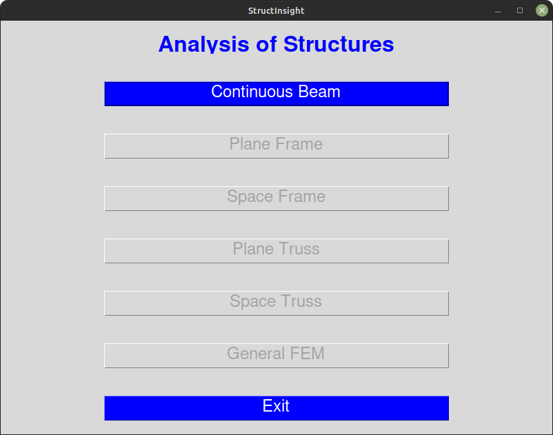

# StructInsight
##### (Developed Using Python Programming Language)

Software for analysis of various types of statically determinate and indeterminate structures such as continuous beam, plane truss, space truss, plane frame, space frame, etc. using the stiffness matrix method.

-----

## Introduction

This project is work in progress and is inspired by another project with the same name. The earlier [StructInsight](https://github.com/khirwadkar/StructInsight) was written in Java programming language. The functionality provided by the present version (December 2023) of this project is limited to analysis of only one type of structure and that is *continuous beam*. It is essentially a translation of the previous project from Java to Python programming language. Of course, some improvements have been made; notably, the use of 'numpy' library for more efficient matrix operations. Also, the overall organization of the project is changed to make it more modular for easy expansion and modification. 

-----

## Aim of the project

The primary aim of this project is to help the students in developing and enhancing the "feel" of the behaviour of structures. Although there are quite a few popular structural analysis and design software programs available, this program differs by being simple to use, intuitive for data input, and quite lightweight. In the present state of its development, it allows the user to quickly define the geometry of a continuous beam, and then see its behaviour under different load combinations. The behaviour, in the form of reactions, shear forces, bending moments, and deflections is shown graphically. The numerical output is also available for further processing. An undergraduate student can solve many exercise problems in very less amount of time using this software, and better internalise the understanding of the structural behaviour. Aided with this software, a professor/teacher can present more illustrative examples during their lectures. A working professional may use this software for creating the first rough design by quickly sifting through different alternative combinations of individual beams and loads.

The shift in the programming language for this software from Java to Python was initiated due to the rising popularity of the latter among the developer community. From the last several years, it is observed that Python has become the most used language in the domain of Artificial Intelligence (AI) and Machine Learning (ML) projects. This is due to the fact that *Python* has a plethora of tools and libraries tailored for solving the AI/ML problems. Thus the expectations and reasoning behind the switch to *Python* are as follows.
- It is a well-known fact that a student learns a programming language at higher speed if the examples or exercises in the training program are from their familiar domain. So, it is expected that the students of structural engineering would develop interest in *Python* and they would become proficient in it quickly by studying the source code of *StructInsight*.
- It would be easy for them to foray into the AI/ML field.
- The study of this software would cause brain-storming among structural engineers to bring AI/ML to their own field.

The overall plan of the *StructInsight* project can be understood from the following figure showing the opening menu.

The menu shown in the above figure pops up on the monitor screen when you run the main module (\__main__.py) of *StructInsight*. As can be clearly seen, only two buttons ("Continuous Beam" and "Exit") are enabled, while the rest of the buttons are disabled. This is because, as of now (December 2023) only continuous beam analysis module has been implemented. It is expected that this repository would be forked by the open-source contributor community in the structural engineering domain and they would build the remaining modules. It is also hoped that researchers or students from undergraduate and graduate programs would contribute to this project; or alternatively they take inspiration and clue from this project and build their own independent projects.

-----

## Modules in StructInsight

As mentioned earlier, analysis of only one type of structure is implemented at present and that structure is continuous beam. The program for analysis of continuous beams is divided into two packages. Consequently, besides the main module in '\__main__.py' file, there are two more packages available at present, viz., *continuousbeam* and *continuousbeam-backend*. The installation procedure and other information about the *continuousbeam* package is available [here](https://github.com/khirwadkar/StructInsight_in_Python/blob/main/continuousbeam/README.md), while that for the *continuousbeam-backend* package is available [here](https://github.com/khirwadkar/StructInsight_in_Python/blob/main/continuousbeam_backend/README.md). Click on this [Link](https://gist.github.com/khirwadkar/8eb67b213de9144d004fd1e1cf09b75d) to read or download the user manual (in 'pdf' format) for the *continuousbeam* package.

-----

